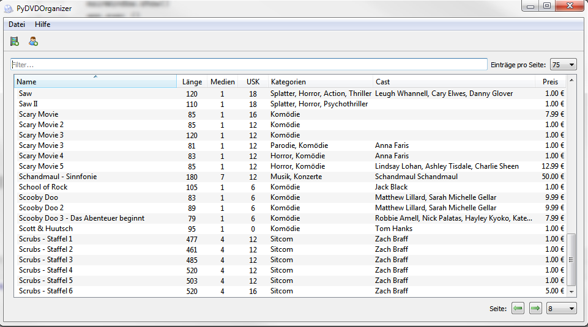
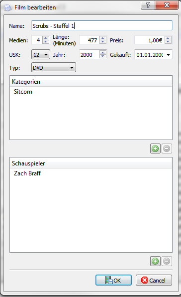

# PyDVDOrganizer

This is a rewrite and the more up-to-date Codebase from my DVDOrganizer++

Initially this used to be written in Turbo Delphi, i then moved over to C++ and Qt
and now the third iteration is written in Python and PyQt5.

I plan on working on this Python Version for some time and extend it further... well... obviously until my job requires Skills in yet another language / framework... then this gets ported again :-p

---

## Screenshot of the Mainwindow

## Screenshot of the Edit Window

